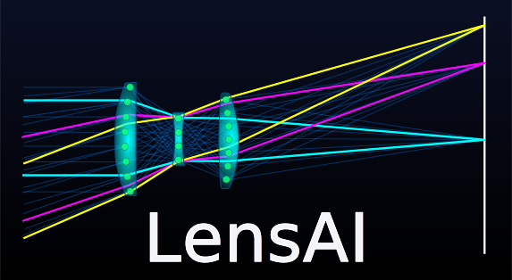

<div align="center">
  <a href="https://github.com/HarrisonKramer/LensAI">
    
  </a>
</div>

## Integrated Machine and Deep Learning for Optical Systems

Welcome to **LensAI**, a collection of studies where machine learning (ML) and deep learning (DL) techniques are applied to the field of optics and optical design. These studies leverage the power of AI to investigate and solve challenges in lens design, wavefront correction, ray tracing, and more, all using the open-source lens design tool [Optiland](https://github.com/HarrisonKramer/optiland) alongside standard scientific libraries.

> [!NOTE]
> This project is in active development. New notebooks are added regularly.

# Overview

This repository contains a series of Jupyter notebooks exploring how ML and DL can be used to enhance and automate various tasks in optical engineering. Topics of interest include:

- Lens Design Optimization
- Aberration Classification and Correction
- Wavefront Error Prediction and Correction
- Inverse Design of Lens Systems
- Reinforcement Learning for Optical Design
- Generative Lens Design
- Super-resolution Applications in Wavefront Detection
- Deep Learning for Optimal Tolerance Sensitivities
- Surrogate Models for Raytracing

By integrating AI methodologies into optics, we aim to improve the efficiency and innovation in optical system design, from faster optimizations to generating new designs.

## Notebook Summaries

The following is an overview of existing, in progress, and planned studies:

- [**Random Forest Regressor to Predict Optimal Lens Properties**](https://github.com/HarrisonKramer/LensAI/blob/main/notebooks/Example_1/Singlet_RF_Model_RMS_Spot_Size.ipynb)
  - Demonstrates how to build and train a random forest regressor to predict the radius of curvature of a plano-convex lens in order to minimize the RMS spot size.
- [**Ray Path Failure Classification Model**](https://github.com/HarrisonKramer/LensAI/blob/main/notebooks/Example_2/Ray_Path_Failure_Classification_Model.ipynb)
  - Uses logistic regression to predict ray path failures in a Cooke triplet design.
- [**Surrogate Ray Tracing Model Using Neural Networks**](https://github.com/HarrisonKramer/LensAI/blob/main/notebooks/Example_3/Double_Gauss_Surrogate_Model.ipynb)
  - Builds a neural network surrogate ray tracing model to increase effective "ray tracing" speed by 10,000x.
- [**Super-Resolution Generative Adversarial Network to Enhance Wavefront Map Data**](https://github.com/HarrisonKramer/LensAI/blob/main/notebooks/Example_5/SR_GAN_for_wavefront_data.ipynb)
  - Utilizes a super-resolution GAN (SRGAN) to upscale low-resolution wavefront data into high-resolution data.
- [**Optimization of Aspheric Lenses via Reinforcement Learning**](https://github.com/HarrisonKramer/LensAI/blob/main/notebooks/Example_4/RL_aspheric_singlet.ipynb)
  - Reinforcement learning is applied to the optimization of aspheric singlet lenses to generate new lens designs.
- [**Regression Models for Lens Misalignment Prediction Using Wavefront Map Data**](https://github.com/HarrisonKramer/LensAI/blob/main/notebooks/Example_6/Misalignment_Prediction_Cooke_Triplet.ipynb)
  - Investigate various regression models to predict lens misalignment in a Cooke triplet design.
- **Reinforcement Learning for Generating New Lens Starting Point Designs** - planned
- **Diffusion Models for Generative Lens Design** - planned
- **Neural Network for Prediction of Lens Seidel Aberration Coefficients from Surface Data** - planned
- **Generative Adversarial Networks for Extrapolating New Lens Starting Point Designs** - planned
- **Regression Model to Extrapolate Aberration Performance Across Spectral Bands** - planned
- **Autoencoders for Wavefront Data Compression** - planned
- **_Insert Your Idea Here_** - if you have an idea for a notebook, consider [opening an issue](https://github.com/HarrisonKramer/LensAI/issues) or [submitting a pull request](https://github.com/HarrisonKramer/LensAI/pulls).


# Dependencies

This repository is built on top of the following dependencies:

- [optiland](https://github.com/HarrisonKramer/optiland) - For performing optical system simulations and analyses.
- [numpy](https://numpy.org/) - Fundamental package for numerical computation.
- [scipy](https://scipy.org/) - Optimization and scientific functions.
- [scikit-learn](https://scikit-learn.org/stable/index.html) - Machine learning algorithms.
- [torch](https://pytorch.org/) - Deep learning with PyTorch.
- [matplotlib](https://matplotlib.org/) - Plotting and visualization.
- [pandas](https://pandas.pydata.org/) - Data manipulation and analysis.
- [seaborn](https://seaborn.pydata.org/) - Statistical data visualization.
- [tqdm](https://tqdm.github.io/) - Progress bars in Jupyter notebooks.
- [imblearn](https://imbalanced-learn.org/stable/) - Resample imbalanced datasets.
- [gymnasium](https://gymnasium.farama.org/) - Standard API for reinforcement learning
- [stable-baselines3](https://stable-baselines3.readthedocs.io/en/master/) - Reinforcement learning algorithms in PyTorch.

# Getting Started

Explore the various examples in the [Notebooks](https://github.com/HarrisonKramer/LensAI/tree/main/notebooks) directory or run the examples yourself by cloning the repository and installing the required dependencies:

```sh
git clone https://github.com/HarrisonKramer/LensAI.git
cd LensAI
pip install -r requirements.txt
```

Navigate to a Jupyter notebook file and open in your favorite editor (e.g., [Visual Studio Code](https://code.visualstudio.com/)).

Note that if you wish to use PyTorch with cuda support, please install torch by following the steps on the [PyTorch website](https://pytorch.org/get-started/locally/).

# Contributing

Contributions are welcome! If you have new ideas for optical studies using machine learning or deep learning, feel free to [open an issue](https://github.com/HarrisonKramer/LensAI/issues) or [submit a pull request](https://github.com/HarrisonKramer/LensAI/pulls).

# References
1. Yow, A.P., Wong, D., Zhang, Y. et al. Artificial intelligence in optical lens design. Artif Intell Rev 57, 193 (2024).
2. Tong Yang, Dewen Cheng, and Yongtian Wang, "Designing freeform imaging systems based on reinforcement learning," Opt. Express 28, 30309-30323 (2020).
3. Bentley, J., Olson, C., & Society of Photo-Optical Instrumentation Engineers. (2012). Field guide to lens design. SPIE
4. Greivenkamp, J. E., & Society of Photo-Optical Instrumentation Engineers. (2004). Field guide to geometrical optics. SPIE
5. Côté G, Lalonde J-F, Thibault S (2019a) Extrapolating from lens design databases using deep learning. Opt Express 27(20):28279–28292
6. Côté G, Lalonde J-F, Thibault S (2021) Deep learning-enabled framework for automatic lens design starting point generation. Opt Express 29(3):3841–3854
7. Côté G, Zhang Y, Menke C, Lalonde J-F, Thibault S (2022) Inferring the solution space of microscope objective lenses using deep learning. Opt Express 30(5):6531–6545
8. Dilworth D (1987) Applications of Artificial Intelligence To computer-aided Lens Design. SPIE

# Contact

If you have any remarks, requests, issues, suggestions, or find a bug/mistake, please feel free to [open an issue](https://github.com/HarrisonKramer/LensAI/issues) in the repository.

Kramer Harrison - kdanielharrison@gmail.com
